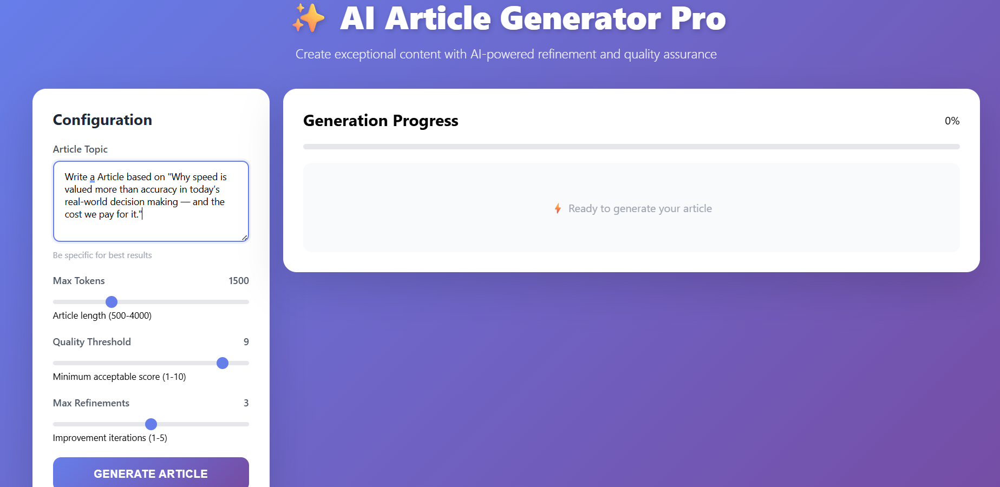
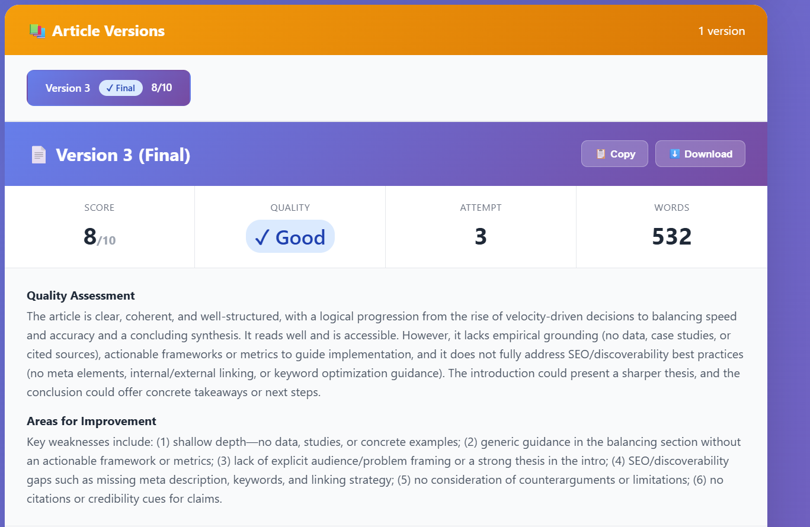

# Multi-Agent Article Generation System with gated loop content refinement 


## 📋 Table of Contents

- [Overview](#overview)
- [System Architecture](#system-architecture)
- [Features](#features)
- [Prerequisites](#prerequisites)
- [Installation](#installation)
- [Configuration](#configuration)
- [Usage](#usage)
- [Code Walkthrough](#code-walkthrough)







## 🎥 Demo Video
[Click here to watch the demo](https://github.com/user-attachments/assets/54851a0e-1396-4fe1-8540-4af84dd80bbf)


## 🎯 Overview

The Multi-Agent Article Generation System is an intelligent content creation pipeline that leverages four specialized AI agents to produce high-quality, publication-ready articles. The system employs an iterative refinement process where articles are continuously evaluated and improved until they meet stringent quality standards.

### How It Works

1. **Agent 1 (Content Writer)**: Generates the initial article based on your topic
2. **Agent 2 (Content Grader)**: Evaluates the article and assigns a quality score (0-10)
3. **Agent 3 (Change Proposer)**: Analyzes weaknesses and proposes specific improvements
4. **Agent 4 (Content Refiner)**: Applies proposed changes to create an improved version

The system runs iteratively until the article achieves a quality score of ≥9.5 or reaches the maximum refinement attempts.

## 🏗️ System Architecture

```
┌─────────────────┐
│  User Input     │
│  (Topic)        │
└────────┬────────┘
         │
         ▼
┌─────────────────────────────────────────────────────────┐
│                    AGENT 1                              │
│              Content Writer (GPT-4.1)                   │
│  • Generates initial article                            │
│  • Follows best practices                               │
│  • SEO-optimized content                                │
└────────────────────┬────────────────────────────────────┘
                     │
                     ▼
         ┌───────────────────────┐
         │     AGENT 2           │
         │  Content Grader       │
         │  • Scores article     │
         │  • Identifies issues  │
         └──────┬────────────────┘
                │
         ┌──────▼──────┐
         │ Score ≥9.5? │
         └──┬───────┬──┘
       YES  │       │  NO
            │       │
            │       ▼
            │  ┌─────────────────┐
            │  │    AGENT 3      │
            │  │ Change Proposer │
            │  │ • Analyzes gaps │
            │  │ • Suggests fixes│
            │  └────────┬────────┘
            │           │
            │           ▼
            │  ┌─────────────────┐
            │  │    AGENT 4      │
            │  │ Content Refiner │
            │  │ • Applies fixes │
            │  │ • Polishes text │
            │  └────────┬────────┘
            │           │
            │           └──► Loop back to Agent 2
            │                (Max 3 iterations)
            │
            ▼
    ┌──────────────┐
    │ Final Output │
    │ (Best Article)│
    └──────────────┘
```

## ✨ Features

- **Iterative Quality Improvement**: Continuous refinement until quality standards are met
- **Multi-Agent Collaboration**: Four specialized AI agents working in tandem
- **Real-Time Streaming**: Server-Sent Events (SSE) for live progress updates
- **Quality Scoring**: Objective evaluation based on industry best practices
- **Configurable Thresholds**: Adjust quality scores and refinement attempts
- **RESTful API**: Easy integration with FastAPI backend
- **Best Version Tracking**: Always returns the highest-scoring article
- **Comprehensive Logging**: Detailed progress tracking throughout the process

## 📦 Prerequisites

- Python 3.8 or higher
- OpenAI API key with GPT-4 access
- pip (Python package installer)
- Virtual environment (recommended)

## 🚀 Installation

### 1. Clone the Repository

```bash
git clone https://github.com/Hemanth-Rachaboyina/Article_generation_llamaindex.git
cd Article_generation_llamaindex
```

### 2. Create Virtual Environment

```bash
# Create virtual environment
python -m venv venv

# Activate virtual environment
# On Windows:
venv\Scripts\activate
# On macOS/Linux:
source venv/bin/activate
```

### 3. Install Dependencies

```bash
pip install -r requirements.txt
```

**requirements.txt**:
```
fastapi>=0.100.0
uvicorn[standard]>=0.23.0
openai>=1.0.0
pydantic>=2.0.0
python-dotenv>=1.0.0
workflows>=0.1.0
asyncio
```

## ⚙️ Configuration

### 1. Environment Variables

Create a `.env` file in the project root:

```bash
# .env
OPENAI_API_KEY=your_openai_api_key_here
```

### 2. Model Configuration

Edit `prompts.py` to change the model:

```python
# Use GPT-4o-mini for faster, cost-effective results
model = "gpt-4o-mini"

# Or use GPT-4.1 for highest quality
# model = "gpt-4.1"
```

### 3. Workflow Parameters

Adjust in `mainflow.py` or via API request:

```python
MAX_REFINEMENTS = 3    # Maximum refinement iterations
THRESHOLD = 9.0        # Quality score threshold (0-10)
```

## 📘 Usage

### Starting the API Server

```bash
# Start the FastAPI server
python api.py

# Server will run on http://localhost:8000
```

### Using the API

#### Health Check

```bash
curl http://localhost:8000/api/health
```

#### Generate Article (Streaming)

```bash
curl -X POST http://localhost:8000/api/generate-article \
  -H "Content-Type: application/json" \
  -d '{
    "topic": "The Future of Artificial Intelligence",
    "threshold": 9.0,
    "max_refinements": 3
  }'
```


```bash
# Run the workflow script
python mainflow.py
```

## 🔍 Code Walkthrough

### 1. **individual_functions.py** - Core Agent Functions

This module contains the four main agent functions:

#### Agent 1: Content Writer

```python
async def Content_writer(query: str) -> str:
    """
    Generates initial article content.
    
    Args:
        query: The topic/prompt for article generation
        
    Returns:
        str: Generated article content
    """
```

**Purpose**: Creates a well-structured, SEO-optimized article based on the input topic.

**Key Features**:
- Uses GPT-4.1 for high-quality generation
- Follows structured output with Pydantic
- Implements professional content writing best practices

#### Agent 2: Content Grader

```python
async def Content_grader(article_content: str) -> tuple[int, str, str]:
    """
    Evaluates article quality and provides feedback.
    
    Args:
        article_content: The article to evaluate
        
    Returns:
        tuple: (score, justification, weaknesses)
    """
```

**Purpose**: Objectively scores articles on a 0-10 scale based on editorial standards.

**Evaluation Criteria**:
1. Clarity and coherence
2. Structure and logical flow
3. Depth and completeness
4. Readability and engagement
5. SEO best practices
6. Introduction and conclusion strength
7. Overall editorial polish

#### Agent 3: Change Proposer

```python
async def Content_changes_proposer(
    article_content: str,
    score: int,
    justification: str,
    weaknesses: str,
    Threshold: int
) -> str:
    """
    Proposes specific improvements based on evaluation.
    
    Args:
        article_content: Current article
        score: Quality score from Agent 2
        justification: Reasoning for the score
        weaknesses: Identified weak points
        Threshold: Target quality score
        
    Returns:
        str: Proposed changes and improvements
    """
```

**Purpose**: Analyzes weaknesses and provides actionable improvement suggestions.

**Output**: Concrete, implementable suggestions for structural, content, and clarity improvements.

#### Agent 4: Content Refiner

```python
async def Content_refiner(article_content: str, changes: str) -> str:
    """
    Applies proposed changes to create improved version.
    
    Args:
        article_content: Current article
        changes: Proposed improvements from Agent 3
        
    Returns:
        str: Refined, publication-ready article
    """
```

**Purpose**: Carefully applies suggested changes while preserving the article's intent and tone.

### 2. **prompts.py** - System Prompts

Contains carefully crafted prompts for each agent:

```python
model = "gpt-4o-mini"  # or "gpt-4.1"

Article_Generator_Prompt = """..."""
Article_scorer_Prompt = """..."""
Article_changes_proposer_prompt = """..."""
Refined_Article_Prompt = """..."""
```

**Best Practices in Prompts**:
- Clear role definitions
- Specific output requirements
- Structured evaluation criteria
- Concrete guidelines for each agent

### 3. **api.py** - FastAPI Backend

#### Request Model

```python
class ArticleRequest(BaseModel):
    topic: str                              # Article topic
    max_tokens: Optional[int] = 1500        # Token limit
    threshold: Optional[float] = 9.0        # Quality threshold
    max_refinements: Optional[int] = 3      # Max iterations
```

#### Streaming Generator

```python
async def generate_article_stream(request: ArticleRequest):
    """
    Main orchestration function with SSE streaming.
    
    Process:
    1. Generate initial article
    2. Enter refinement loop (max 3 iterations)
    3. For each iteration:
       - Grade article
       - Check if threshold met
       - If not, propose changes
       - Refine article
    4. Return best version
    """
```

**Key Features**:
- Server-Sent Events for real-time updates
- Best version tracking across iterations
- Early exit when quality threshold is met
- Comprehensive error handling

### 4. **mainflow.py** - Workflow Orchestration

```python
class MainWorkflow(Workflow):
    @step
    async def start(self, ctx: Context, ev: StartEvent) -> StopEvent:
        # 1. Generate initial article
        article = await Content_writer(query=query)
        
        # 2. Refinement loop
        for attempt in range(1, MAX_REFINEMENTS + 1):
            # 2a. Grade article
            score, justification, weaknesses = await Content_grader(article)
            
            # 2b. Track best version
            if score > best_score:
                best_score = score
                best_article = article
            
            # 2c. Check threshold
            if score >= THRESHOLD:
                return StopEvent(result={...})
            
            # 2d. Check max attempts
            if attempt >= MAX_REFINEMENTS:
                return StopEvent(result={...})
            
            # 2e. Propose changes
            changes = await Content_changes_proposer(...)
            
            # 2f. Refine article
            article = await Content_refiner(...)
        
        return StopEvent(result={...})
```


---

**Built with ❤️ by [Hemanth Royal]**

Last Updated: December 2025